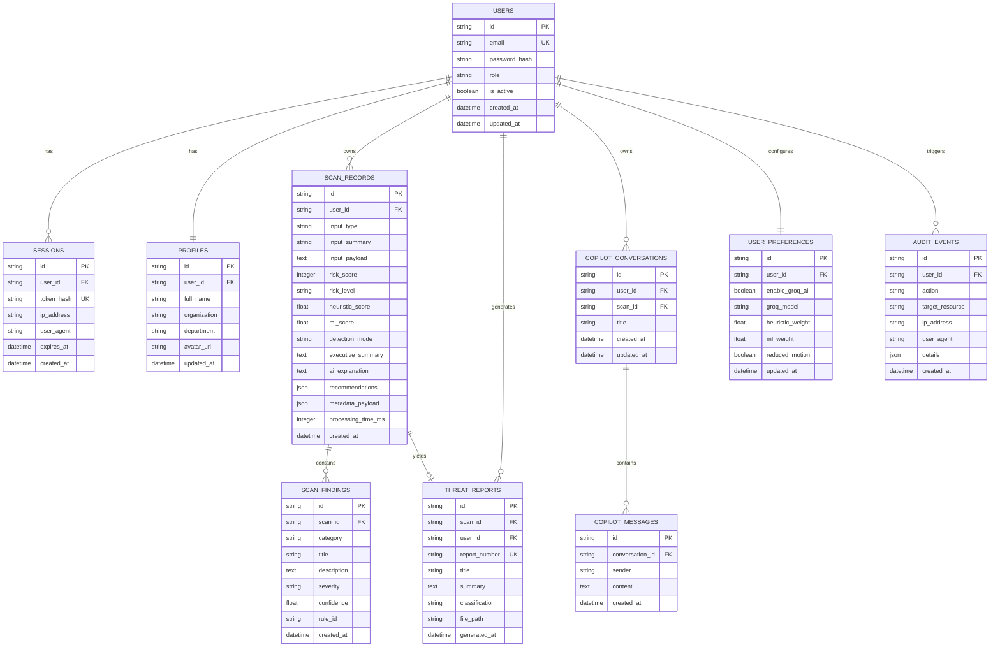

# CYBERGUARD — Database Schema Specification

## 1. Overview & Storage Engine

CYBERGUARD supports a relational schema compatible with SQLite (local development and demo environments) and PostgreSQL / Supabase (enterprise production). All primary keys are UUIDs (stored as strings in SQLite and native UUIDs in Postgres).

Foreign keys are strictly enforced with cascading deletions where appropriate (e.g., deleting a scan cascades to its findings and report).

---

## 2. Entity-Relationship Diagram

---

## 3. Detailed Table Specifications

### 3.1 `users`
Represents administrative / demo accounts authorized to access the system.
- `id` (VARCHAR(36), PK): UUID.
- `email` (VARCHAR(255), UNIQUE, NOT NULL): User identity email.
- `password_hash` (VARCHAR(255), NOT NULL): Argon2id or bcrypt salted hash.
- `role` (VARCHAR(50), DEFAULT 'analyst'): Roles: `admin`, `analyst`, `viewer`.
- `is_active` (BOOLEAN, DEFAULT TRUE): Account status flag.
- `created_at` (DATETIME, NOT NULL): UTC creation timestamp.
- `updated_at` (DATETIME, NOT NULL): UTC last modification timestamp.

### 3.2 `profiles`
User profile details.
- `id` (VARCHAR(36), PK): UUID.
- `user_id` (VARCHAR(36), FK -> `users.id`, ON DELETE CASCADE): Target user.
- `full_name` (VARCHAR(150)): Display name (e.g. "Senior Security Analyst").
- `organization` (VARCHAR(150)): Corporate organization.
- `department` (VARCHAR(150)): e.g. "Cyber Defense Center".
- `avatar_url` (VARCHAR(500), NULLABLE): Image path or avatar token.
- `updated_at` (DATETIME, NOT NULL): Modification timestamp.

### 3.3 `sessions`
Active session registry for secure cookie authentication.
- `id` (VARCHAR(36), PK): UUID.
- `user_id` (VARCHAR(36), FK -> `users.id`, ON DELETE CASCADE): User reference.
- `token_hash` (VARCHAR(64), UNIQUE, NOT NULL): SHA-256 hash of the cryptographically random session cookie token.
- `ip_address` (VARCHAR(45)): Client IP at login.
- `user_agent` (VARCHAR(255)): Client browser user agent string.
- `expires_at` (DATETIME, NOT NULL): Absolute expiration timestamp.
- `created_at` (DATETIME, NOT NULL): Timestamp session was issued.

### 3.4 `scan_records`
Core threat analysis record.
- `id` (VARCHAR(36), PK): UUID.
- `user_id` (VARCHAR(36), FK -> `users.id`, ON DELETE CASCADE): Analyst who conducted scan.
- `input_type` (VARCHAR(32), NOT NULL): One of `url`, `email`, `message`, `qr`, `auth_log`, `network`, `headers`.
- `input_summary` (VARCHAR(255), NOT NULL): Brief sanitized title/snippet for listing.
- `input_payload` (TEXT, NOT NULL): Sanitized original input or payload excerpt.
- `risk_score` (INTEGER, NOT NULL): Calculated 0–100 integer score.
- `risk_level` (VARCHAR(16), NOT NULL): `LOW`, `MEDIUM`, or `HIGH`.
- `heuristic_score` (FLOAT, NOT NULL): Raw 0–100 heuristic output.
- `ml_score` (FLOAT, NOT NULL): Raw 0–100 ML probability output.
- `detection_mode` (VARCHAR(32), NOT NULL): `HYBRID_AI`, `HYBRID_LOCAL`, `HEURISTIC_ONLY`.
- `executive_summary` (TEXT, NOT NULL): High-level finding synopsis.
- `ai_explanation` (TEXT, NULLABLE): Markdown narrative explaining evidence.
- `recommendations` (JSON, NOT NULL): Array of action strings.
- `metadata_payload` (JSON, NULLABLE): Structural facts (e.g., IP parsed, hop count, QR payload).
- `processing_time_ms` (INTEGER, NOT NULL): Execution latency in milliseconds.
- `created_at` (DATETIME, NOT NULL, INDEX): Timestamp for ordering and KPIs.

### 3.5 `scan_findings`
Line-item evidence points identified by heuristic rules or ML models.
- `id` (VARCHAR(36), PK): UUID.
- `scan_id` (VARCHAR(36), FK -> `scan_records.id`, ON DELETE CASCADE): Associated scan.
- `category` (VARCHAR(64), NOT NULL): e.g. `NETWORK`, `IMPERSONATION`, `STRUCTURAL`, `CONTENT`.
- `title` (VARCHAR(200), NOT NULL): Concise indicator label.
- `description` (TEXT, NOT NULL): Detailed technical explanation.
- `severity` (VARCHAR(16), NOT NULL): `CRITICAL`, `HIGH`, `MEDIUM`, `LOW`, `INFO`.
- `confidence` (FLOAT, NOT NULL): Confidence weight (0.0 to 1.0).
- `rule_id` (VARCHAR(64), NOT NULL): Identifier of the firing heuristic rule (e.g., `RULE_URL_IP_HOST`).
- `created_at` (DATETIME, NOT NULL).

### 3.6 `threat_reports`
Generated exportable incident reports.
- `id` (VARCHAR(36), PK): UUID.
- `scan_id` (VARCHAR(36), FK -> `scan_records.id`, ON DELETE CASCADE): Associated scan.
- `user_id` (VARCHAR(36), FK -> `users.id`, ON DELETE CASCADE): Issuer.
- `report_number` (VARCHAR(64), UNIQUE, NOT NULL): Formal identifier (e.g., `CG-2026-0927-0042`).
- `title` (VARCHAR(255), NOT NULL): Report header.
- `summary` (TEXT, NOT NULL): Executive overview.
- `classification` (VARCHAR(32), DEFAULT 'RESTRICTED / TLP:AMBER'): Security classification banner.
- `file_path` (VARCHAR(500), NULLABLE): Path to compiled PDF on storage.
- `generated_at` (DATETIME, NOT NULL).

### 3.7 `copilot_conversations` & `copilot_messages`
Contextual chat threads tied to specific scans or general security advisory.
- `copilot_conversations`: `id`, `user_id`, `scan_id` (NULLABLE), `title`, `created_at`, `updated_at`.
- `copilot_messages`: `id`, `conversation_id`, `sender` (`user` or `assistant`), `content`, `created_at`.

### 3.8 `user_preferences`
User settings: Groq toggle, default model, heuristic/ML weights, UI motion preference.

### 3.9 `audit_events`
Tamper-evident system activity log: logins, logouts, scan deletions, report exports, configuration alterations.
- `id`, `user_id`, `action`, `target_resource`, `ip_address`, `user_agent`, `details` (JSON), `created_at`.

---

## 4. Database Indexes
- `idx_users_email` ON `users(email)`
- `idx_sessions_token_hash` ON `sessions(token_hash)`
- `idx_sessions_expires_at` ON `sessions(expires_at)`
- `idx_scan_records_user_id` ON `scan_records(user_id)`
- `idx_scan_records_created_at` ON `scan_records(created_at DESC)`
- `idx_scan_records_risk_level` ON `scan_records(risk_level)`
- `idx_scan_records_input_type` ON `scan_records(input_type)`
- `idx_scan_findings_scan_id` ON `scan_findings(scan_id)`
- `idx_audit_events_created_at` ON `audit_events(created_at DESC)`
