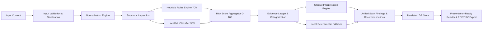

# CYBERGUARD — Product Requirements Document (PRD)

## 1. Product Overview

**Product Name:** CYBERGUARD  
**Tagline:** Scan. Explain. Protect.  
**Product Story:** PROTECT → ANALYSE → DETECT → EXPLAIN → RESPOND  
**Positioning:** An enterprise-grade, defensive cybersecurity threat protection platform engineered to analyze suspicious URLs, emails, messages, QR codes, authentication logs, network telemetry, and raw email headers. CYBERGUARD identifies phishing, impersonation, credential harvesting, and suspicious anomalies, demystifies the technical evidence through transparent heuristics and AI, and provides actionable defensive responses.

CYBERGUARD is strictly a **defensive security console** — not an attack simulator, exploit tool, or generic hacker dashboard.

---

## 2. Core Personas & Problem Statement

### 2.1 Personas
- **Security Operations Center (SOC) Tier-1 / IT Helpdesk:** Needs rapid triage of reported employee emails, suspicious SMS/chat messages, and anomalous login alerts without falling victim to payload execution.
- **Enterprise Employee / Security Champion:** Needs an intuitive, high-contrast interface to safely check links, QR codes, and suspicious communications before clicking or authorizing credentials.
- **Security Auditor / Compliance Lead:** Needs tamper-evident audit trails, exportable PDF reports with executive summaries, and verifiable risk assessments based on deterministic evidence rather than black-box guesses.

### 2.2 Key Pain Points Addressed
1. **Opaque Security Tools:** Security software often gives a binary "malicious/clean" verdict without explaining *why*, leading to user distrust or alert fatigue.
2. **Accidental Detonation / SSRF:** Inexperienced analysts might click links or trigger SSRF vulnerabilities when testing suspicious payloads.
3. **Hallucinated or Fabricated AI Threats:** Generic LLMs often hallucinate threats or invent non-existent indicators. CYBERGUARD constrains AI to explaining *strictly detected evidence*.
4. **Poor Display on Projectors / War Rooms:** Standard security consoles have low contrast, tiny fonts, and clutter that make group presentations and incident response triage difficult.

---

## 3. High-Level Product Architecture & Flow

---

## 4. Functional Requirements

### 4.1 Input Ingestion & Scanner Capabilities
CYBERGUARD supports 7 dedicated inspection vectors:
1. **URL Scanner:** Static structural analysis, IP hostname detection, lookalike/typosquatting matching, punycode/IDN inspection, suspicious deep subdomains, credential-stealing paths (`/login`, `/wp-login.php`, `/.well-known/`), protocol downgrade (HTTP), and redirect tracking flags. *Strict SSRF safety: the server never navigates to arbitrary destinations.*
2. **Email Scanner:** Envelope/header alignment, sender domain spoofing, urgency heuristics, credential extortion keywords, suspicious attachment signature indicators, and financial redirection language.
3. **SMS / Instant Message Scanner:** Smishing patterns, urgency cues, banking impersonation, multi-factor authentication (MFA/OTP) theft triggers, and high-risk shortlink domains.
4. **QR Code Scanner:** Client-side drag-and-drop / upload, secure backend image parsing, extraction of embedded payloads, and chained evaluation of extracted content without auto-executing destinations.
5. **Authentication Logs Scanner:** Ingestion of syslog, JSON, or standard auth event records (Failed logins, brute force bursts, impossible travel indicators, privilege escalation events, off-hours administrative access).
6. **Network Activity Scanner:** Telemetry parsing for beaconing intervals, anomalous port connections, DNS tunneling markers, excessive byte transfer ratios, and known command-and-control (C2) behavioral patterns.
7. **Raw Email Headers Scanner:** RFC 822 / 5322 header parsing (`Received` chain hops, `From`, `Reply-To`, `Return-Path` anomalies, `Authentication-Results` SPF/DKIM/DMARC status analysis).

### 4.2 Scoring & Evidence Model
- **Score Range:** 0 to 100 normalized risk score.
  - **0 – 30:** Low Risk (Protected / Safe).
  - **31 – 70:** Medium Risk (Suspicious / Manual Review Advised).
  - **71 – 100:** High Risk (Critical / Threat Identified).
- **Hybrid Composition:**
  - **70% Deterministic Security Heuristics:** Transparent rule weights evaluated against exact signatures.
  - **30% Machine Learning:** Local TF-IDF Vectorizer + Scikit-Learn Logistic Regression model trained on cybersecurity threat corpus.
- **Verifiable Evidence Ledger:** Every scan produces explicit, line-item evidence tokens with confidence ratings and severity (low, medium, high, critical).

### 4.3 AI Explanation & Copilot
- **Backend-Only Groq Integration:** Calls Groq LLM (e.g. `llama-3.3-70b-versatile` or `mixtral-8x7b-32768`) via server-side environment secrets.
- **Grounded Prompting:** AI receives only normalized facts and detected evidence. It provides:
  - Executive summary
  - Evidence-based technical breakdown
  - Potential security impact
  - Step-by-step protective countermeasures
  - Explicit confidence limitations
- **Graceful Offline Fallback:** If `GROQ_API_KEY` is missing or the external API is unreachable, the engine automatically falls back to deterministic rule-based explanations without failing the scan.
- **Interactive Security Copilot Drawer:** Authenticated slide-over drawer allowing users to interrogate the scan findings, clarify risk ratings, or ask defensive mitigation questions.

### 4.4 Data Persistence, History & Analytics
- **Database Backend:** SQLite for local development; PostgreSQL / Supabase for production.
- **Scan History:** Comprehensive search, multi-factor filtering (input type, risk tier, date range), detail inspector, and deletion.
- **Export Formats:**
  - **PDF:** Formal enterprise incident report built server-side with ReportLab, including executive summary, evidence table, risk gauge visual, and recommendations.
  - **CSV & JSON:** Full structured telemetry export for SIEM integration.
- **Dashboard KPIs:** All metrics (Total Scans, High Risk, Suspicious, Safe, Detection Modes) derive strictly from stored database records. Uses rolling animated counters when data updates.

### 4.5 Controlled Authentication & Security Controls
- **No Public Registration:** Zero sign-up, register, or create-account routes.
- **Controlled Demo Provisioning:** Pre-configured demo administrative account initialized securely via environment configuration / database seed.
- **Session Security:** Cryptographically signed session tokens stored in `HttpOnly`, `SameSite=Lax`, `Secure` cookies.
- **Password Storage:** Argon2id / bcrypt hashing with salt. No plain hashes.
- **No Frontend Secrets:** API keys and credentials are never exposed in bundles or browser logs.

---

## 5. Non-Functional Requirements & Projector UX

- **Projector-Ready Contrast:** Strict dark theme with high contrast (`#F5F7FA` text on `#08090C` background).
- **Legibility Targets:** Minimum 16px body, 18px form labels, 72px risk score hero display, 40px+ KPI numbers.
- **Performance:** Sub-second local heuristic and ML analysis; sub-2.5s end-to-end response including Groq AI generation.
- **Motion & Accessibility:** Full WCAG 2.1 AA compliance, accessible ARIA attributes, keyboard navigation, and explicit respect for `prefers-reduced-motion`.
- **Reliability:** 100% functional without Groq internet access via local heuristics and ML fallbacks.
